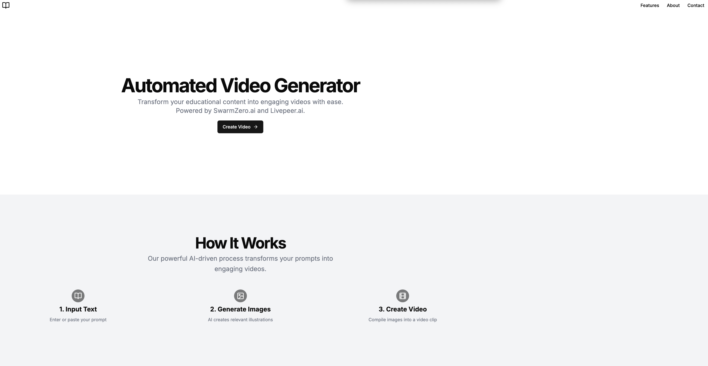
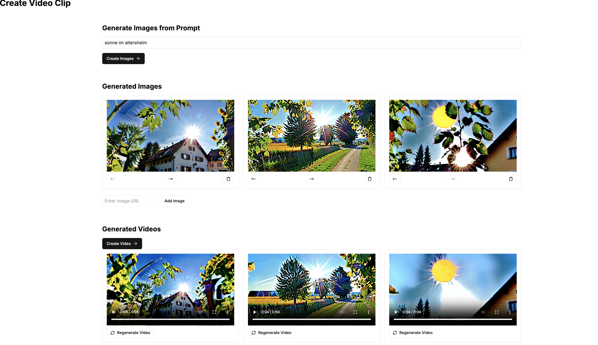

# Automated Video Generator

## Overview

This project is a comprehensive solution for automatically generating videos. It consists of a frontend built with Next.js and a backend API powered by SwarmZero.ai and Livepeer.ai. The system automates the video creation process, from prompting to video editing and uploading.

 <!-- Add an image for the overview section -->

## Frontend: Next.js Application

The frontend is a Next.js application that provides a user interface for creating video content. Users can input text, generate images, convert images to videos, and preview the final video.

### Key Features

- **Text to Image**: Convert text prompts into images using AI.
- **Image to Video**: Transform images into video clips.
- **Video Preview**: Preview the final video before uploading.
- **Responsive Design**: Optimized for various screen sizes.

### Project Structure

- **Pages**: The main pages are located in the `src/app` directory.
- **Components**: Reusable UI components are in the `src/components` directory.
- **Styles**: Global styles are defined in `src/styles/globals.css`.

### Scripts

- `dev`: Start the development server.
- `build`: Build the application for production.
- `start`: Start the production server.
- `lint`: Run ESLint to check for code quality.

### Configuration

- **TypeScript**: The project is configured with TypeScript for type safety.
- **Tailwind CSS**: Utilized for styling the application.

### Screenshots

 <!-- Add an image for the screenshots section -->

 <!-- Add an image for the screenshots section -->

## Backend: API with SwarmZero.ai and Livepeer.ai

The backend is an API that orchestrates the video creation process using SwarmZero.ai for swarm intelligence and Livepeer.ai for media processing.

 <!-- Add an image for the backend section -->

### Key Features

- **Swarm Intelligence**: Uses a swarm of agents to handle different aspects of video production.
- **AI-Powered Media Processing**: Leverages Livepeer.ai for image and video generation.
- **YouTube Integration**: Automates the uploading of videos to YouTube.

### Project Structure

- **Main Application**: The entry point is `backend/main.py`.
- **Swarm Logic**: Core logic and agent definitions are in the `backend/hive_swarm` directory.
- **Tools**: Utility functions for file handling and API interactions are in `backend/hive_swarm/tools`.

### Installation

1. Clone the repository:

   ```bash
   git clone https://github.com/datadudech/video-platform
   cd video-platform
   ```

2. Install the required dependencies for backend:
   I recommend using a virtual environment
   because of conflict Pillow needs reinstalled again

   ```bash
   cd backend
   python -m venv .venv
   source .venv/bin/activate
   pip install -r requirements.txt

   pip install Pillow==0.9.5

   ```

3. Set up environment variables:

   - Create a `.env` from `.env.swarmzero` file in the root directory and add necessary API keys and credentials.

4. Start the **backend**

   ```
   uvicorn main:app --reload
   ```

   check `localhost:8000/docs`

5. Start the **frontend** from route
   ```
    npm install
    npm run dev
   ```
   check `localhost:3000`

### Configuration

- **Swarm Configuration**: Adjust agent models, timeouts, and instructions in `hive_config.toml`.

## Contributing

Contributions are welcome! Please feel free to submit a Pull Request.

## Acknowledgements

- **Livepeer**: For providing AI image and video generation capabilities.
- **SwarmZero.ai**: For the swarm intelligence framework.
